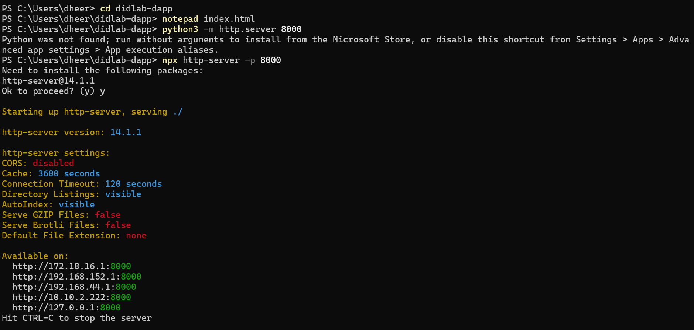
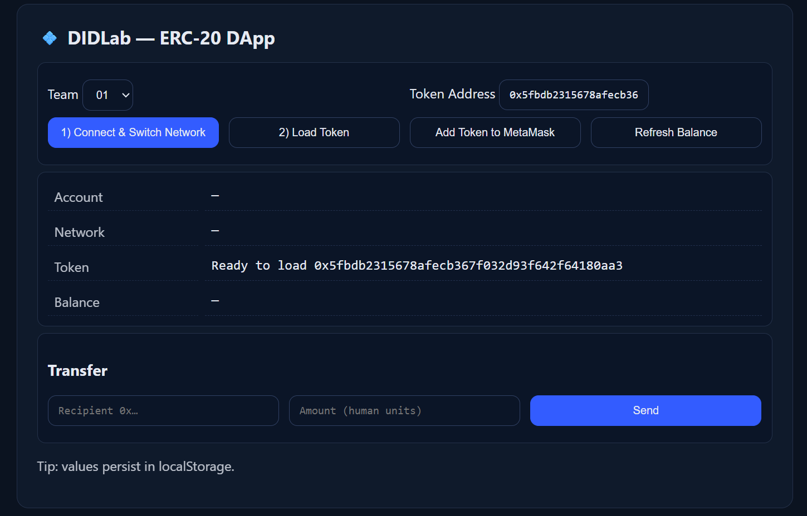
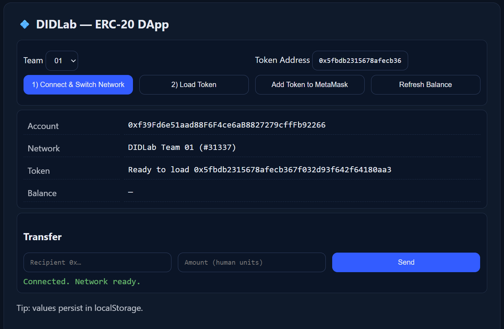
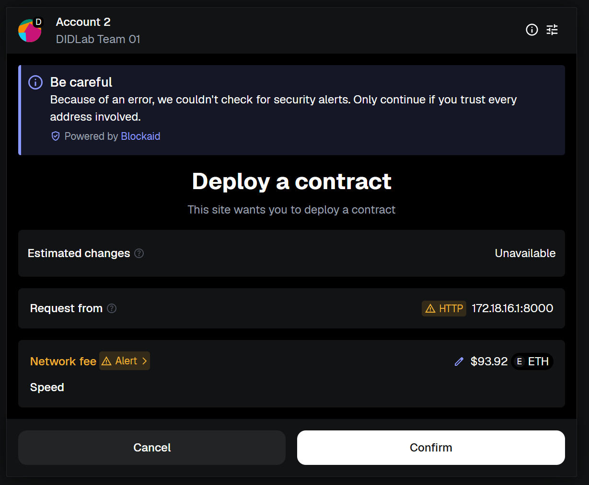
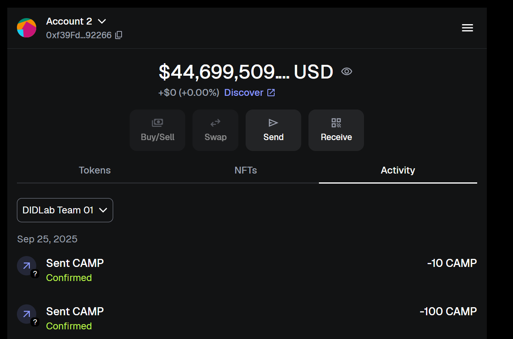
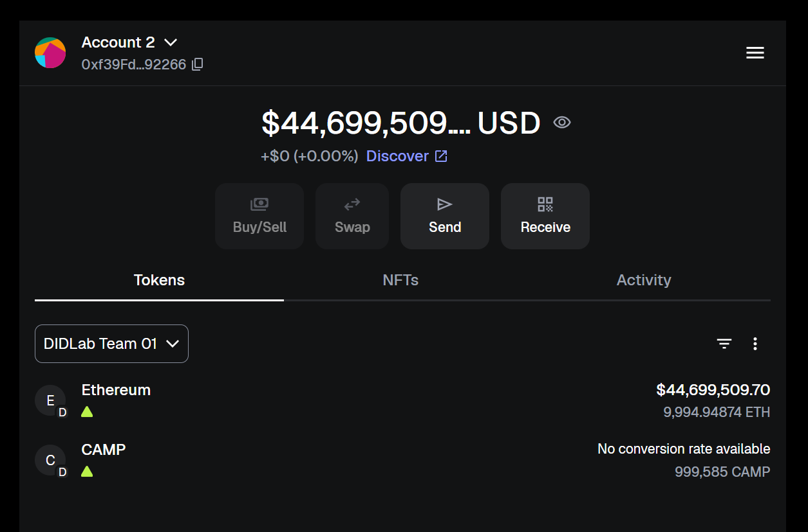

# Activity 4 — DIDLab ERC-20 DApp UI

This repository contains the tiny DApp UI built for the **CampusCredit (CAMP)** ERC-20 token on the DIDLab network.

---

## Project Overview
The goal of this activity is to build a single-file web application that:
- Connects to **MetaMask** and switches to the DIDLab network
- Loads the ERC-20 token metadata (name, symbol, decimals)
- Displays the connected account’s balance
- Allows sending token transfers
- Updates the balance automatically on transfers

---

## Configuration
- **Team:** 01  
- **RPC URL:** `https://hh-01.didlab.org`  
- **Chain ID:** `31337`  
- **Token Address:**  
  ```
  0x5fbdb2315678afecb367f032d93f642f64180aa3
  ```

---

## Running the DApp
1. Clone this repo:
   ```bash
   git clone <your-repo-url>
   cd didlab-dapp
   ```
2. Start a local web server:
   ```bash
   python3 -m http.server 8000
   ```
   or
   ```bash
   npx http-server -p 8000
   ```
3. Open the DApp in your browser:
   ```
   http://localhost:8000
   ```

---

## Usage
1. **Connect & Switch Network** → Approve MetaMask prompt.  
2. **Load Token** → Displays name, symbol, decimals, and balance.  
3. **Refresh Balance** → Manually update balance.  
4. **Send** → Enter recipient `0x...` and amount, then approve in MetaMask.  
5. **Add Token to MetaMask** → Shows CAMP balance directly inside MetaMask.

---

## Screenshots
Here are screenshots showing the working DApp:

### 1. Smart Contract Deployment


### 2. DApp Loaded Successfully


### 3. Token Added to MetaMask


### 4. Transfer in MetaMask Popup


### 5. Transfer Submitted (Success 1)


### 6. Transfer Submitted (Success 2)


### 7. Transfer Confirmed in MetaMask


### 8. Updated Balances After Transfer



---

## Submission
- Token Address: `0x5fbdb2315678afecb367f032d93f642f64180aa3`  
- DApp UI: `index.html`  
- Evidence: Screenshots in repo  

---
